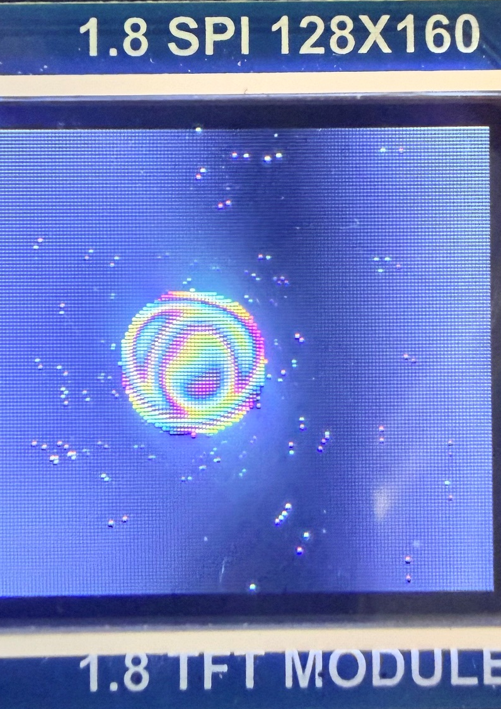
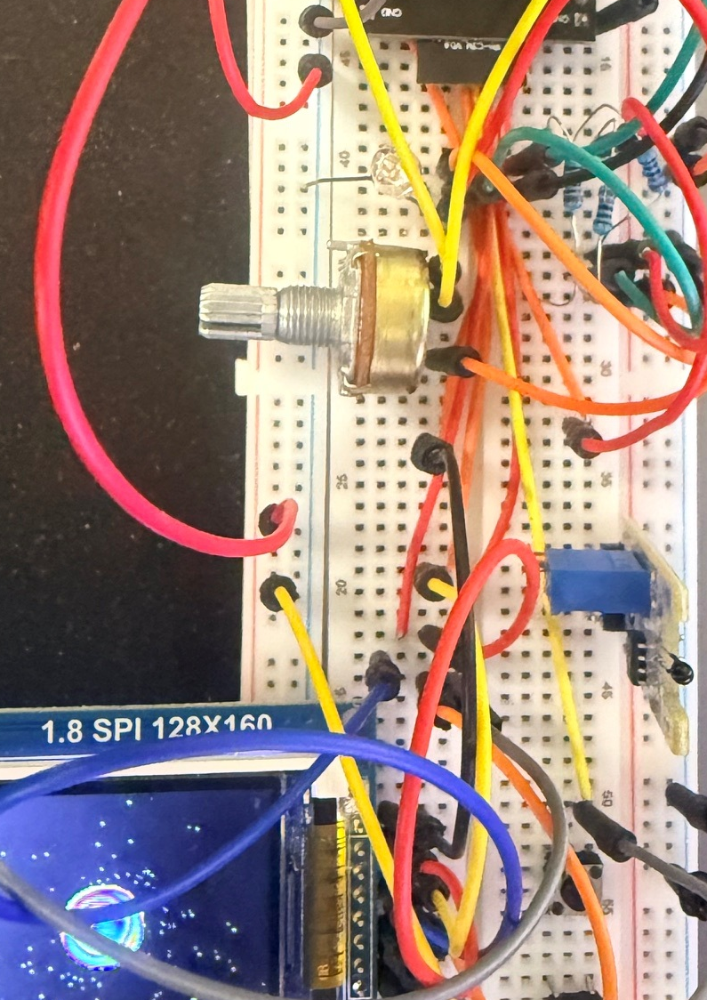
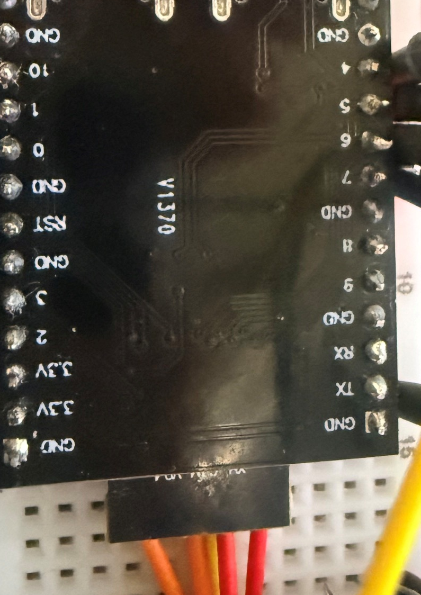

# 01_blink

ESP32-C3 DevKitM + 1.8 inch SPI TFT running a tiny Zephyr demo with an Amiga-style plasma ball, rotating starfield, RGB LED setup, and scrolling text.



## What This Is

This started as the `01_blink` Zephyr learning app and now drives a small ST7735-based 1.8 inch SPI TFT module directly over SPI. The firmware keeps its own RGB565 framebuffer, renders animated plasma and stars, then pushes the full frame to the display.

The code stays intentionally close to the hardware:

| Area | Files |
| --- | --- |
| App loop and effects | `src/main.c` |
| ST7735 SPI display driver | `src/st7735.c`, `src/st7735.h` |
| Small drawing helpers | `src/gfx.c`, `src/gfx.h` |
| RGB LED helper | `src/rgb.c`, `src/rgb.h` |
| ESP32-C3 wiring | `boards/esp32c3_devkitm.overlay` |

## Project Photos

| Running display | Breadboard wiring | TFT module back |
| --- | --- | --- |
|  |  |  |

## Hardware

Target board:

| Part | Notes |
| --- | --- |
| MCU | ESP32-C3 DevKitM / ESP32-C3 DevKit-style board |
| Display | 1.8 inch SPI TFT, ST7735-compatible |
| Screen mode | 128 x 160, RGB565 |
| RTOS | Zephyr |

Default ESP32-C3 wiring from the overlay and driver:

| Signal | ESP32-C3 GPIO |
| --- | ---: |
| TFT MOSI/SDA | GPIO3 |
| TFT SCK/SCL | GPIO7 |
| TFT CS | GPIO1 |
| TFT DC/A0 | GPIO2 |
| TFT RST | GPIO0 |
| RGB red | GPIO10 |
| RGB green | GPIO5 |
| RGB blue | GPIO6 |
| ADC input | ADC0 channel 4 |

## Build

From your existing Zephyr workspace:

```powershell
west build -p always -b esp32c3_devkitm/esp32c3 C:\path\to\01_blink
```

From a fresh checkout using this repo as a west manifest:

```powershell
west init -m https://github.com/mschyllander/01_blink zephyr-01-blink
cd zephyr-01-blink
west update
west blobs fetch hal_espressif
west build -p always -b esp32c3_devkitm/esp32c3 app
```

## Flash

```powershell
west flash --reset-type watchdog-reset
west espressif monitor
```

If the board flashes but the image is blank, check the `CS`, `DC`, `RST`, `MOSI`, and `SCK` pins first. If colors or orientation look wrong, tune the ST7735 init commands in `src/st7735.c`, especially `MADCTL` (`0x36`) and inversion (`0x20`/`0x21`).

## Notes

The photos show the real project hardware. The firmware renders the animation directly on the TFT; no bitmap assets are embedded in the MCU image.
